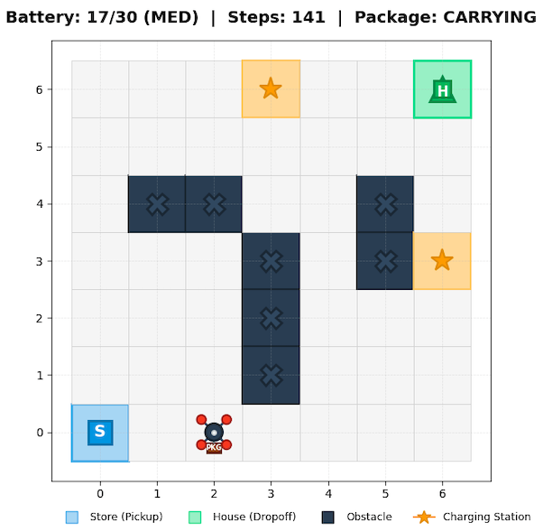

# MDP Lab: Drone Delivery with Wind and Battery (Tabular RL)

This project implements a custom Gymnasium environment for a drone delivery task with wind‑induced action noise and a battery constraint. It includes tabular Dynamic Programming (Value Iteration, Policy Iteration), tabular Monte Carlo Control (on‑policy and off‑policy with importance sampling), and SARSA(λ) with linear function approximation (basic/one‑hot/engineered/tile coding).



## Environment Summary
- Grid world (discrete): width × height.
- Obstacles (impassable cells).
- Pickup location (start) and Drop-off location (goal).
- Battery levels with charge action at charging stations.
- Wind slip: with probability `p_slip`, a move action deviates 90° left or right; otherwise it goes as intended.
- Rewards:
  - -1 per time step.
  - -20 on collision (into wall/obstacle; agent stays in place).
  - +50 on successful delivery (episode terminates).
  - -10 if battery depletes before delivery (episode terminates).

Default settings keep the state space small and suitable for tabular methods.

## Formal MDP Specification
- State space S:
  - Tuples `(x, y, b, p)` where `x ∈ {0..width-1}`, `y ∈ {0..height-1}`, `b ∈ {0..max_battery}`, and `p ∈ {0,1}` indicates whether the drone still carries the package.
  - Obstacles are impassable cells; the agent position never enters them.
- Action space A:
  - `{UP, DOWN, LEFT, RIGHT, STAY, CHARGE}`.
- Transition dynamics P(s'|s,a):
  - Movement actions are affected by wind slip: with probability `1 - 2·p_slip` the intended direction is taken; with probability `p_slip` the action is rotated 90° left; with probability `p_slip` it is rotated 90° right.
  - Collisions (moving out of bounds or into obstacles) keep the agent in place and add a collision penalty.
  - Battery rules: attempting movement decrements battery by 1 if `b > 0`; if `b == 0` and a movement is attempted, the episode terminates with an additional penalty. `STAY` and `CHARGE` do not consume battery; `CHARGE` increases battery by `charge_rate` at charging stations (clamped to `max_battery`).
  - Termination: delivery (reaching drop-off while carrying package), battery depletion without delivery, or reaching `max_steps` (truncation).
- Reward function R(s,a,s'):
  - Base step cost −1 each step; −20 on collision; +50 on successful delivery; −10 on termination by battery depletion.
- Discount factor γ:
  - Typically in `[0.95, 0.99]` for these tasks; configurable in experiments.
- Start state s₀:
  - At pickup location, full battery, and `p=1` (carrying the package).
- Terminal states:
  - Delivery completed (`p` becomes 0) or battery depletion before delivery.

## Algorithms
- Dynamic Programming (requires model P and R):
  - Value Iteration
  - Policy Iteration (iterative policy evaluation + greedy improvement)
- Monte Carlo (model-free):
  - On-policy MC Control, epsilon-soft, first-visit
  - Off-policy Monte Carlo Control using Importance Sampling
- SARSA(λ) (model-free):
  - SARSA(λ) with linear function approximation

## Project Structure
- `envs/drone_delivery.py` — Gymnasium environment with `enumerate_transitions(s, a)` for DP.
- `algorithms/dp.py` — Value Iteration and Policy Iteration implementations.
- `algorithms/mc.py` — On-policy and Off-policy MC Control with Importance Sampling.
- `algorithms/sarsa.py` — SARSA(λ) with linear FA (feature options incl. tile coding, decays, replacing traces, optimistic init).
- `examples/replay_vi_policy.py` — Visualize and evaluate Value Iteration policies.
- `examples/replay_mc_policy.py` — Visualize and evaluate Monte Carlo policies.
- `examples/replay_sarsa_policy.py` — Train/evaluate/replay SARSA(λ) policies.
- `docs/examples_guide.md` — Comprehensive guide for using the example scripts.
- `docs/ALGORITHMS.md` — Detailed algorithm documentation and implementation notes.
- `run_experiments.sh` — Automated experiment suite for VI, MC, and SARSA.
- `requirements.txt` — Lightweight dependencies for the tabular project.

## Setup
Install dependencies (optionally in a virtual environment):

```bash
pip install -r requirements.txt
```

Note: The repository may already have `gymnasium` and `numpy` installed via the top-level `requirements.txt`. The `requirements.txt` adds optional packages used here (e.g., matplotlib, pandas, tqdm).

## Quick Start

### Visualize Value Iteration Policy

```bash
python examples/replay_vi_policy.py \
  --max-battery 30 \
  --obstacles default \
  --sleep 0.5
```

### Visualize Monte Carlo Policy

```bash
python examples/replay_mc_policy.py \
  --max-battery 30 \
  --episodes 5000 \
  --obstacles default \
  --sleep 0.5
```

### Run Automated Experiments

```bash
./run_experiments.sh
```

Results are saved to `vi_experiments.csv`, `mc_experiments.csv`, and `sarsa_experiments.csv`.

### Visualize SARSA(λ) Policy (examples)

```bash
python examples/replay_sarsa_policy.py \
  --no-render \
  --episodes 10000 \
  --features one_hot \
  --gamma 0.995 \
  --epsilon 0.3 --epsilon-final 0.05 \
  --alpha 0.05 --alpha-final 0.01 \
  --lam 0.95 --replacing-traces \
  --optimistic-init 10.0 \
  --max-battery 30 \
  --obstacles default \
  --eval-episodes 200
```

Tile Coding variant (stable and efficient):

```bash
python examples/replay_sarsa_policy.py \
  --no-render \
  --episodes 20000 \
  --features tile \
  --tile-tilings 8 --tile-bins-x 6 --tile-bins-y 6 --tile-bins-b 6 \
  --gamma 0.995 \
  --epsilon 0.3 --epsilon-final 0.02 \
  --alpha 0.007 --alpha-final 0.002 \
  --lam 0.90 --replacing-traces \
  --optimistic-init 5.0 \
  --max-battery 30 \
  --obstacles default \
  --eval-episodes 200
```

## Features

### Enhanced Visualization
- **Live matplotlib rendering** with drone, obstacles, charging stations, and package
- **Trajectory tracking** showing step-by-step decisions
- **Policy summary** with action distribution and Q-values
- **Progress monitoring** with tqdm progress bars for MC/SARSA training
- **Graceful interruption** (Ctrl+C) with partial result saving

### Multiple Charging Stations
The environment supports strategic placement of charging stations:
- Default: Store location (0,0) plus mid-grid stations at (3,6) and (6,3)
- Customizable via `charging_stations` parameter

### Visual Elements
- 🏪 **S** = Store (pickup location)
- 🏠 **H** = House (delivery location)
- ⬛ **X** = Obstacles
- ⭐ **★** = Charging stations
- 🚁 **Drone** = Red triangle with package indicator
- **Battery indicator** with color coding (green/orange/red)

## Documentation

- **[Examples Guide](docs/examples_guide.md)** - Comprehensive guide for using visualization scripts
- **[Algorithms Documentation](docs/ALGORITHMS.md)** - Detailed algorithm specifications and implementation notes

## Example Output

```
============================================================
LEARNED POLICY SUMMARY
============================================================
Total states: 2352
Action distribution across all states:
  UP      :  450 states ( 19.1%)
  DOWN    :  520 states ( 22.1%)
  RIGHT   :  890 states ( 37.8%)
  ...

============================================================
TRAJECTORY USING OPTIMAL POLICY
============================================================
Step   0: pos=(0,0) bat=30 📦 → RIGHT  → reward=  -1.0
Step   1: pos=(1,0) bat=29 📦 → RIGHT  → reward=  -1.0
...
Step  16: pos=(6,6) bat=14 ✓ → TERMINAL
============================================================
RESULT: SUCCESS ✓
Total steps: 16, Total return: 34.00
============================================================
```

